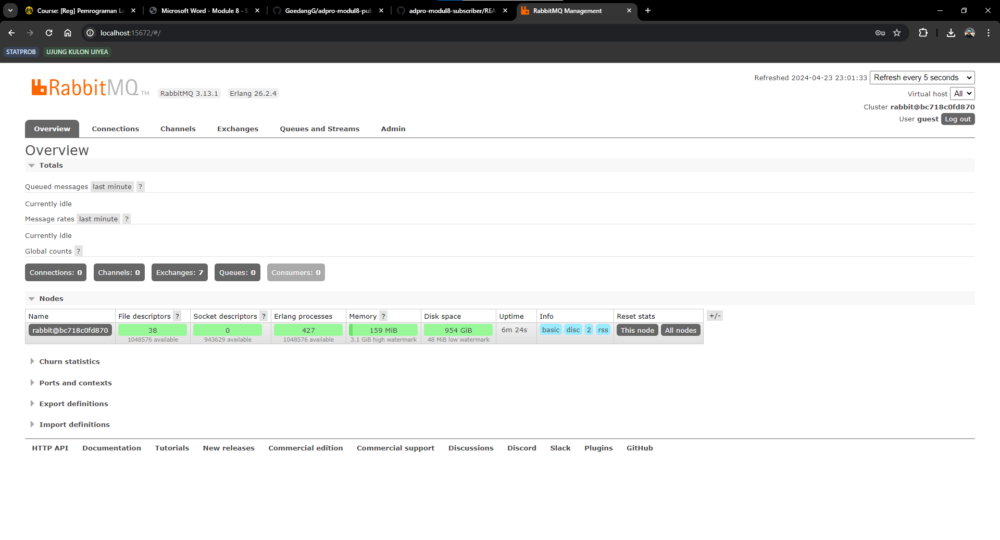
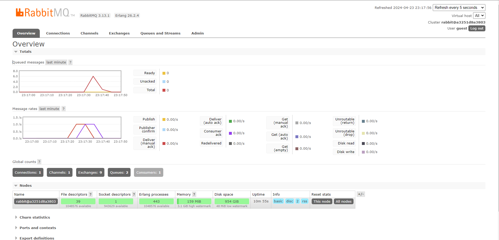
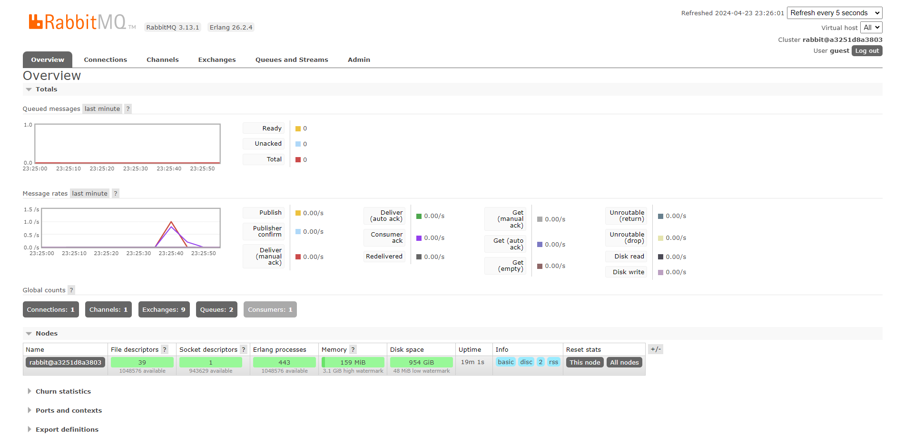

# TUTORIAL 8 - Advance Programming

## Rizqi Bayu Utama - 2206826330

#### Apa itu `amqp`?
- Jawab: AMQP (Advanced Message Queuing Protocol) adalah sebuah protokol yang digunakan untuk mengirim dan menerima pesan antara aplikasi atau sistem yang saling terhubung. Di `main.rs`, AMQP diterapkan untuk antrian pesan yang menghubungkan `UserCreatedHandler` dengan `main` melalui `CrosstownBus`. `UserCreatedHandler` dapat menerima pesan yang dikirimkan ke antrian dengan topik `user_created`.

#### Apa arti dari guest:guest@localhost:5672, apa itu first guest, second guest dan apa fungsi dari localhost:5672?
- Jawab: `guest:guest@localhost:5672` adalah URL yang mengoneksikan ke server AMQP.
    - `first guest`:merujuk pada username untuk autentikasi RabbitMQ.
    - `second guests`: merujuk pada password untuk autentikasi RabbitMQ.
    - `localhost:5672`:adalah alamat dan port dari server RabbitMQ yang akan dihubungi. localhost artinya server RabbitMQ berjalan pada komputer lokal, dan 5672 adalah port default yang digunakan RabbitMQ untuk menerima koneksi.

##### Running RabitMQ

##### Processing Event
Spike terjadi ketika kita melakukan `cargo run` pada `publisher`, hal ini dikarenakan `publisher` mengirimkan data ke message broker dan `subscriber` menerima data tersebut.

##### Simulation Slow Subscribers
Saya melakukan `cargo run` berkali-kali sehingga terjadi spike

##### Monitoring
Saya melakukan `cargo run` dengan adanya jeda kali ini, sehingga spike dapat berkurang dengan cepat
